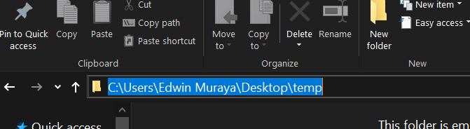
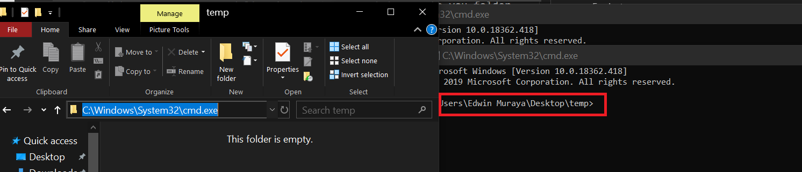

## Steps to follow (What we did)
1. Created a new console project from the command line.

Make sure you command line is where you want to create you folder.
ie.

### For instance
### I want to create in temp desktop folder.
1. Navigate to the folder in file explorer.
2. Hard to explain this step but do this>

 

3. At the highlighted path > replace with cmd and Pless enter.
You command prompt will open in the path.



4. Proceed to creating the new project. 
>  **-o** is a flag for => **output**  and Linq is the output location.
```Csharp
   // Creates a new console project in Linq folder
   dotnet new console -o Linq

```
5. Using the -o flag. Actually creates a new folder.
Since we are in the command line . We could navigate to the folder using the **cd** command.
```CSharp
    //cd standfor => Change Directory/Folder
       cd <directoryname>
    // More practical 
     cd Linq
```
6. Initialize the Folder to a git repository.
```git
      git init
```
7. After you successfully initialized the project. Open the project
with vscode from the same command prompt using.
```bash
   // . standfor => Current directory in CMD,Powershell,Bash

    code .
```
7. Remember 
 -  Each time we build our project. **obj and bin** folder are generated to store our compiled code. Meaning this folder are easy  to recreate when we have the source code. They are are highly changing too. We don't need git to track this folder for us.We could use git but it not necessary for this

 - **Visual studio code, Rider and Visual Studio** also generates some files we don't need in our source control. 

 - Git provide a way to ignore files using a .gitingore file

>  #### Create a .gitignore file and list our the file or folder
 This are for git to ignore them . In the created file enter the folder as follow each in new line.
 ```CSharp
    obj
    bin
 ```
 > # Pull the changes available in github to your local machine.
 ```bash
 // will pull any changes available in the remote repository.
 // git pull => git fetch and git merge
    git pull 
 ```
## (What to do). In visual studio code
 1. Create a new branch and name it *{youname}linq** 
 - open the command prompt > **Ctrl + `** run the following
   ```bash
     // To check the current branch you are working on.
   git branch
    // Outputs> ***Master**   

    // create a new branch
   git branch eduuhlinq


   // rerun the git branch command again
   git branch
       > outputs : eduuhlinq
                   *master
   //the * indicate your active branch. which is still master.

   // To change you branch to your created branch run
   // git checkout <nameofbranch>
   git checkout eduuhlinq
      > outputs : Switched to branch 'eduuhlinq'
   ```
2. You Successfull  created the new branch and changed it to be you active branch.

If you check on Visual studio code left bottom. You will see the branch you are on.

> image

3. Run git status
```bash
// list all the Modified and untracked files
 git status   
```

4. Add the file to a Staging area . This for git to track any changes in this files.
```bash
// adds all the file in the current folder to Staging area
git add .
```

4. Commit Your changes.
```bash
 //Adding meaningfull messages to the changes you make
 // Commit are helpfull incase you want to rollback
git commit -m "created a linq project .
 created a ingredient Class and Initialized an array of Ingredient object " 
```

5. Git status to ensure you are working in a clean tree.
Now we can push our changes to a github remote repository.
But so far git does not know where to push to. 
For a **Remote repository** we require the url. and use the format to add as the remote url to our local repository.

```bash
 // run a git push
 // copy the line > git remote add <name> <url>
 // We replace place holders with the require values
 // For now use the name as => origin
 // url is the destination of the repo
 // our case url => 
  git remote add origin  


```
6. Push the local branch to the remote repository
```bash

// git push --set-upstream <localbranch> <destinationbranch> 
git push --set-upstream eduuhlinq eduuhlinq
```

7. One the Push is successful 
Log in to github and create a pullrequest.

Note: the change will not be accually merged since we are working on the same files. Ofcourse we will have Merge conflicts which will need to be resolved.
